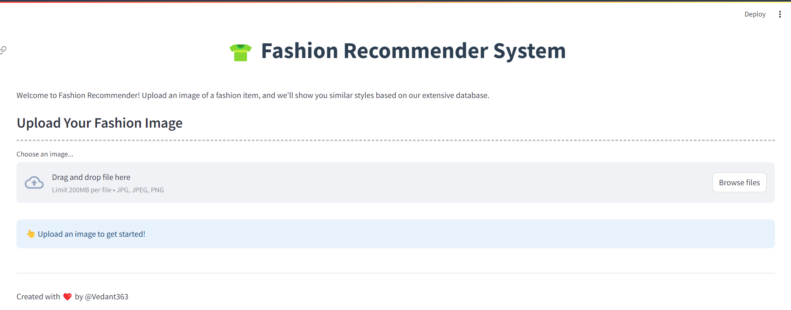
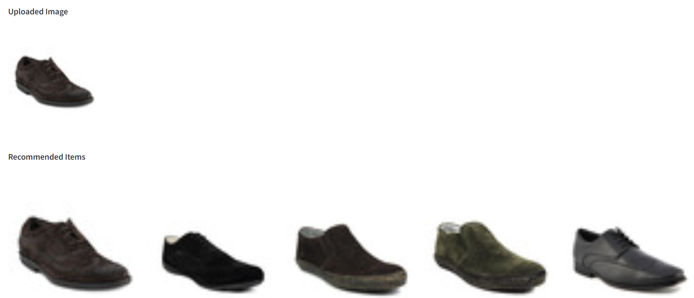
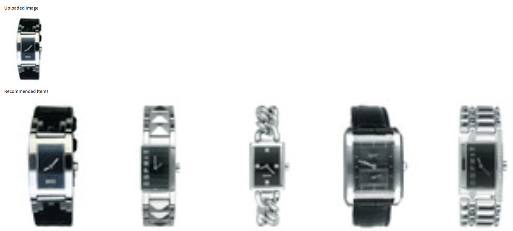

# Fashion Recommender System

This is a fashion recommender system built using Python and Streamlit.

## Overview

The Fashion Recommender System suggests clothing items to users based on the uploaded image and other relevant factors. It aims to enhance the user experience by providing personalized recommendations tailored to individual tastes.

## Features

- User Authentication: Users can create accounts, log in, and update their profiles.
- Recommendation Engine: Utilizes machine learning algorithms to recommend clothing items based on user preferences.
- Interactive Interface: Built using Streamlit to create an intuitive and user-friendly experience.

## Requirements

- Python 3.x
- Streamlit
- Pandas
- Scikit-learn
- NumPy
- etc. (list any other dependencies)

## Installation

1. Clone the repository
2. Install dependencies
3. Run the application
4. Access the application through your web browser.

## Preview

# Test-1

# Test-2

## License

This project is licensed under the [MIT License](LICENSE).

## Acknowledgments

Special thanks to [Streamlit](https://streamlit.io/) for providing an excellent framework for building interactive web applications with Python.
